# 基于springboot的在线考试系统

#### 介绍

在当前数字化教育迅速发展的背景下，传统考试模式面临着诸多挑战，如资源分配不均、考试效率低下、数据管理繁琐等。针对这些问题，我们开发了一个基于Spring Boot的在线考试系统，旨在通过数字化手段，实现考试过程的高效管理，提升教学质量，并为学生提供更加便捷的学习体验。该系统涵盖了管理端、老师端和学生端三种角色，每个角色都拥有其特定的功能模块，以满足不同用户的需求。

尽管现有的在线考试系统已经取得了一定的成功，但它们在功能全面性、用户体验以及数据管理方面仍存在一些局限性和空白。我们的系统致力于填补这些空白，通过提供全面的功能模块和优化的用户体验，打造一个更加完善、高效的在线考试平台。

#### 技术栈

后端技术栈：Springboot+Mysql+Maven

前端技术栈：Vue+Html+Css+Javascript+ElementUI

开发工具：Idea+Vscode+Navicate

#### 系统功能介绍

管理端：  
个人中心：管理员可以查看和修改个人信息。  
基础数据管理：  
班级管理：创建、编辑和删除班级信息。  
公告类型管理：定义和分类公告类型，以便更好地组织公告内容。  
课程类型管理：设置和管理不同的课程类型，如必修课、选修课等。  
科目管理：添加、编辑和删除学科信息，确保课程与科目的准确对应。  
公告管理：发布、编辑和删除全校范围内的公告。  
课程管理：添加、编辑和删除课程信息，包括课程名称、授课老师、上课时间等。  
老师管理：管理教师信息，包括添加新教师、编辑教师资料和删除教师账户。  
学生管理：管理学生信息，包括学生注册、信息编辑和账户管理。  
试卷管理：创建、编辑和删除试卷，以及分配试卷给特定的班级或学生。  

老师端：  
试卷表模块：查看和编辑分配给自己的试卷。  
公告模块：发布和管理与课程相关的公告。  
课程模块：查看和管理自己的课程信息，包括课程资料、作业和课程进度。  
个人中心：查看和修改个人信息。  
后台管理：  
公告管理：发布和编辑课程相关的公告。  
课程管理：编辑和更新课程内容。  
试卷管理：创建、编辑和分配试卷给特定班级或学生。  
考试管理：安排考试时间、监控考试过程和查看考试成绩。  

学生端：  
试卷表模块：查看和提交分配的试卷。  
公告模块：查看学校和课程相关的公告。  
课程模块：查看课程信息、课程资料和作业，以及课程进度。  
个人中心：查看和修改个人信息。  
后台管理：  
公告管理：查看学校和课程相关的公告。  
课程管理：查看和追踪自己的课程进度。  
试卷管理：查看和提交分配的试卷。  
考试管理：查看考试安排、参加在线考试和查看考试成绩。  

#### 系统作用

该在线考试系统通过数字化手段，极大地提高了考试管理的效率，减轻了管理人员和教师的工作负担。同时，它也为学生提供了一个更加便捷、灵活的学习平台，使他们能够随时随地访问课程资料、提交作业和参加考试。此外，系统还增强了数据的准确性和安全性，为教育机构提供了一个全面的数据管理工具。

#### 系统功能截图

代码结构

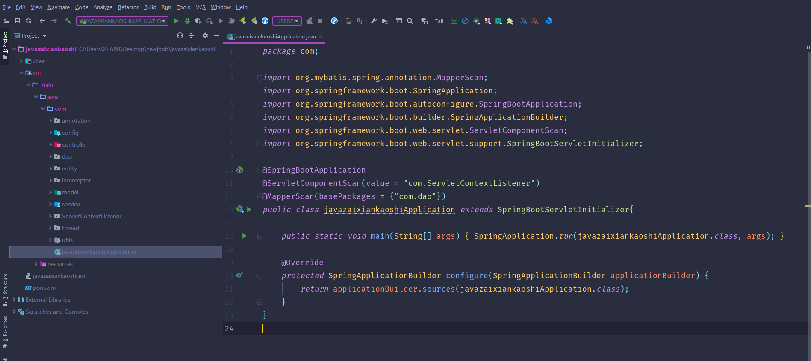

数据库表

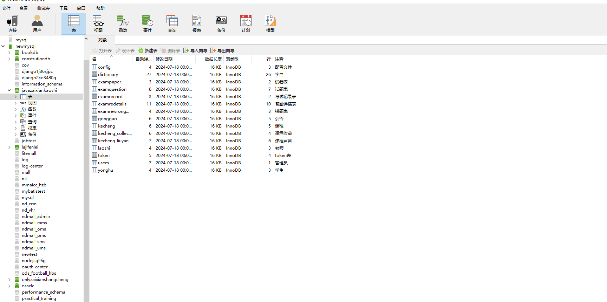

登录

前台页面首页

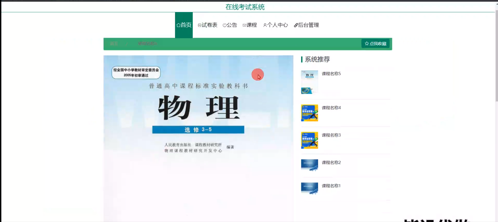

试卷表模块

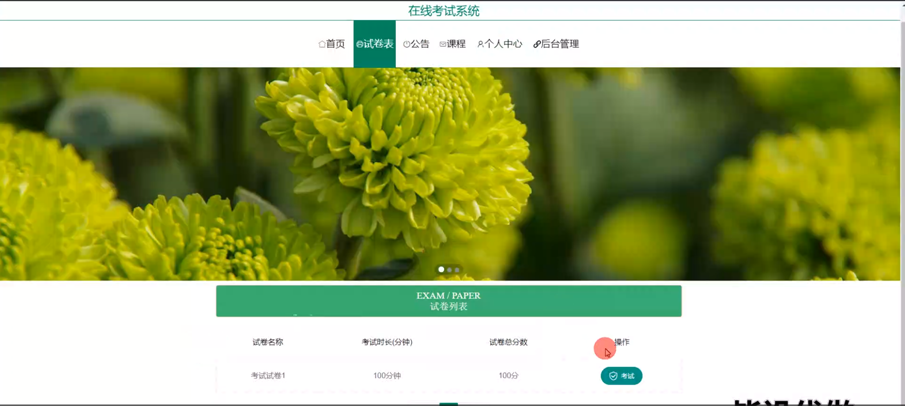

考试界面

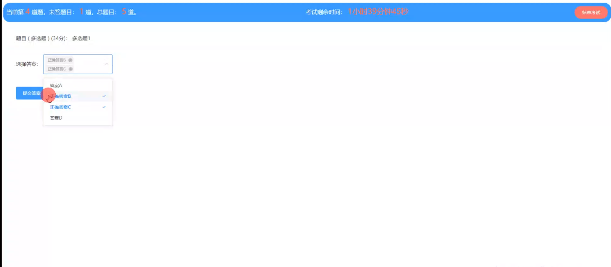

公告模块

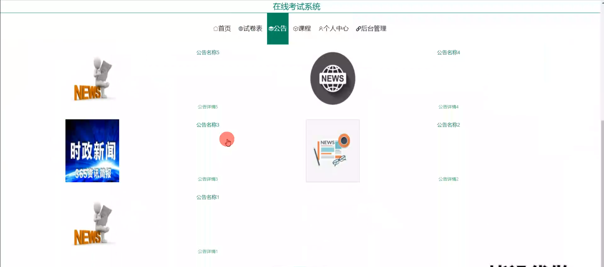

课程模块

个人中心

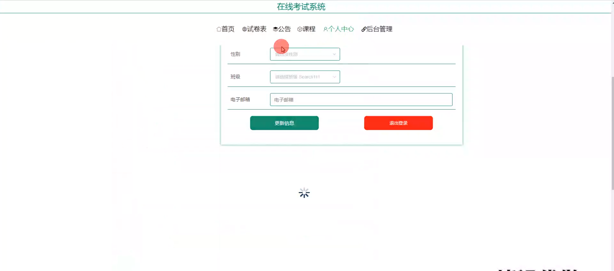

管理员端基础数据管理

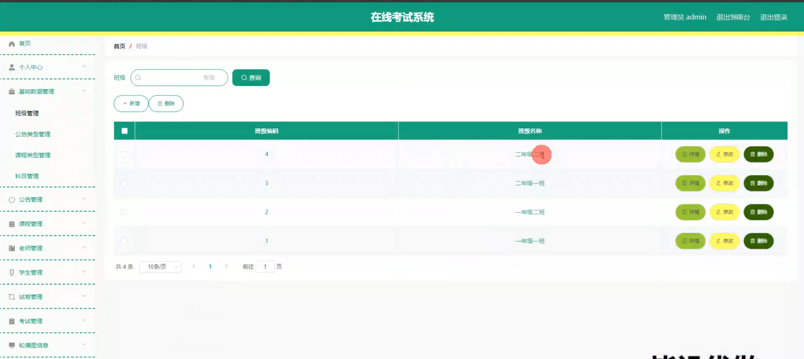

公告管理

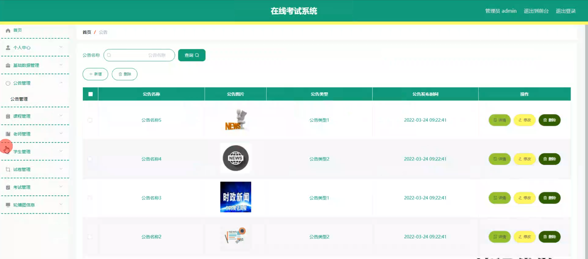

课程管理

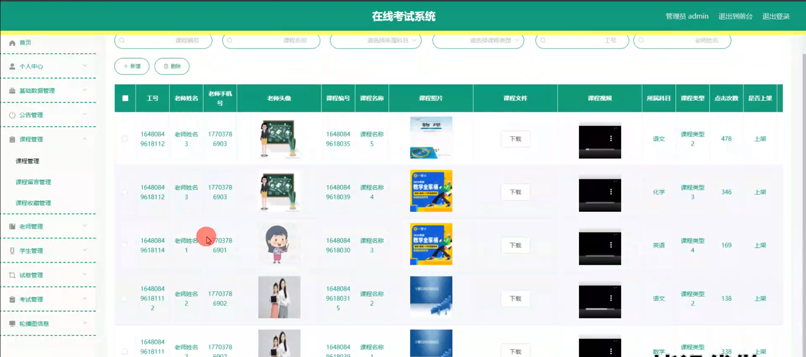

学生管理

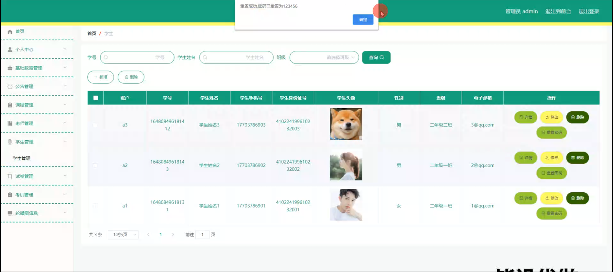

老师端课程留言管理

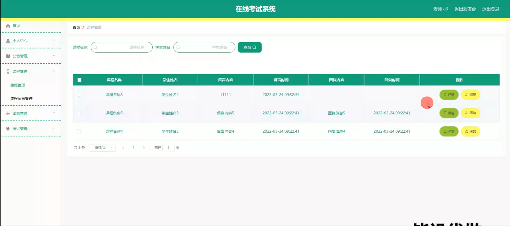

试题管理

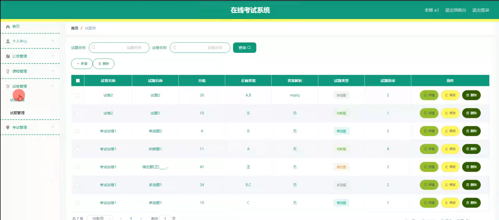

考试记录管理

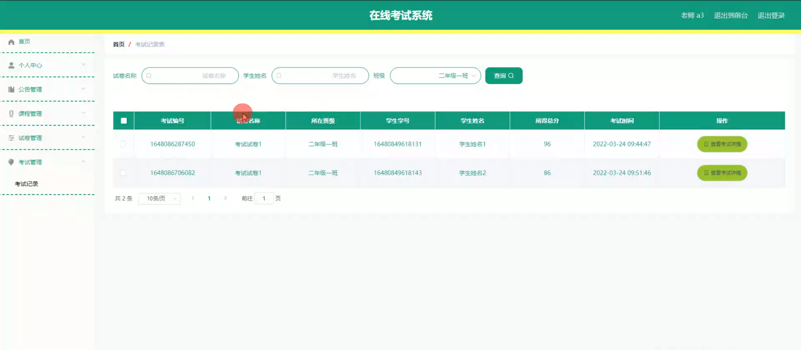

学生端课程管理

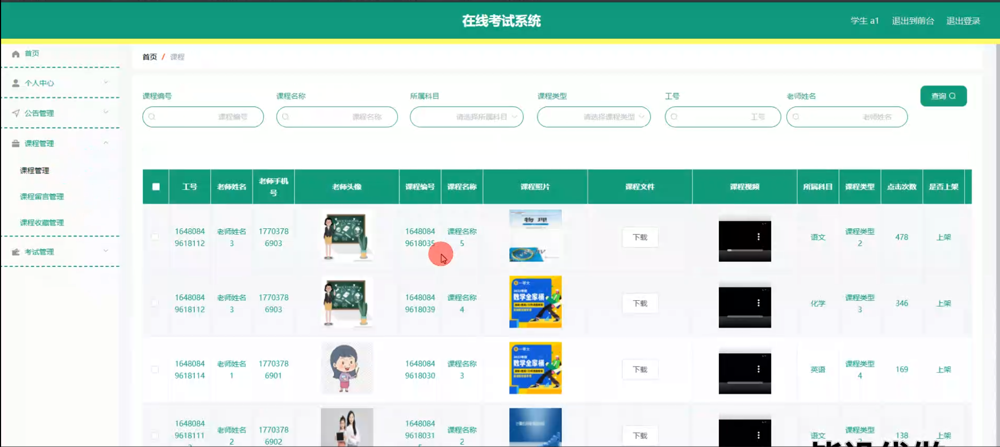

#### 总结

在当前教育数字化转型的大背景下，我们的在线考试系统为教育机构提供了一个全面、高效的考试管理平台。通过整合管理端、老师端和学生端的功能模块，系统不仅优化了考试流程，还提升了教学质量和学习体验。尽管现有的在线考试系统已经取得了一定的成就，但我们的系统通过填补功能空白和优化用户体验，为教育机构提供了一个更加完善、可靠的解决方案。未来，我们将继续完善系统功能，以适应不断变化的教育需求，并致力于推动教育行业的数字化转型。

#### 使用说明

创建数据库，执行数据库脚本 修改jdbc数据库连接参数 下载安装maven依赖jar 启动idea中的springboot项目

前台登录页面
http://localhost:8080/javazaixiankaoshi/front/index.html

后台登录页面
http://localhost:8080/javazaixiankaoshi/admin/dist/index.html

管理员				账户:admin 		密码：admin

老师				账户:a1 		密码：123456

学生				账户:a1 		密码：123456